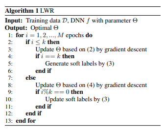

<div align = "center">
    
### ☢️ Learning with Retrospection :radioactive:
</div>

### About

- `LearningWithRetrospection.py` contains class `LWR` which implements the algorithm in [this paper](https://arxiv.org/abs/2012.13098)

### Algorithm

</img>


### Usage

```python

    lwr = LWR(
        k=1, # Number of Epochs (Interval) to update soft labels
        update_rate=0.9, # The rate at which True Label weightage is decayed
        num_batches_per_epoch=len(dataset) // batch_size,
        dataset_length=len(dataset),
        output_shape=(10, ), # Number of Classes
        tau=5, # Temperature -- Just leave it to 5 if you don't know what you're doing
        max_epochs=20, # Max number of epochs
        softmax_dim=1 # Axis for softmax
    )

    data, target = data.to(device), target.to(device)
    optimizer.zero_grad()
    output = model(data)
    loss = lwr(batch_idx, output, target, eval=False) # LWR expects LOGITS
    loss.backward()
    optimizer.step()
    
```
